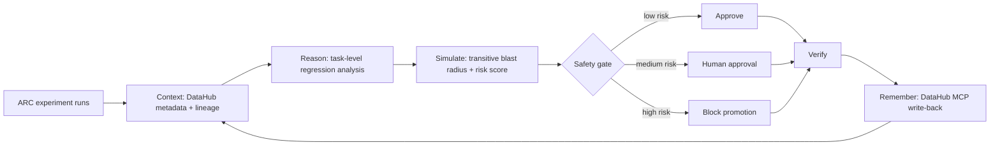

# RuleCraft

**RuleCraft prevents a better-looking AI experiment from silently promoting a worse production model.** It reads DataHub lineage, simulates the downstream blast radius of measured regressions, applies a deterministic safety gate, verifies the decision, and writes durable decision memory back to DataHub.

Built for **Build with DataHub: The Agent Hackathon**. Primary category: **Agents That Do Real Work**.

## Problem

An experiment's aggregate score can improve while a critical task regresses. The run log alone cannot tell whether that regression reaches a benchmark, model release, dashboard, or another team's decision. That dependency and ownership context lives in DataHub.

## Unique insight

**Existing catalogs explain what data exists; RuleCraft uses the context graph to decide whether an AI experiment is safe to promote—and leaves the reason behind for the next human or agent.**

## Signature feature: Counterfactual Experiment Blast-Radius Gate

RuleCraft executes one auditable workflow:

1. **Context** — read candidate experiment metadata and transitive downstream lineage from DataHub.
2. **Reason** — detect per-task improvements and regressions, not just aggregate score.
3. **Simulate** — score every affected asset using measured regression severity, graph depth, and criticality.
4. **Act** — approve, request human approval, or block promotion; produce owner-specific remediation.
5. **Verify** — deterministically check that the gate outcome agrees with the observed regression.
6. **Remember** — write findings, gate status, max risk, impacted count, verification result, tags, and remediation back to DataHub.

This is not an LLM claim or a fabricated benchmark: the gate is deterministic and the included report is generated by the executable demo.

## Demo

Python 3.11+:

```bash
python -m pip install -e .
rulecraft --input examples/arc_experiment_runs.json \
  --output examples/blast_radius_report.json
```

Infrastructure-free output:

```text
RuleCraft
- [regression] arc-001 regressed by 0.50 between solver-v1 and solver-v2.
- [improvement] arc-002 improved by 0.50 between solver-v1 and solver-v2.
Written tags: ['arc-improvement', 'arc-regression', 'needs-review', 'rulecraft-blocked']
Release gate: blocked (risk 95/100)
Impacted assets: 3; verification: PASS
```

The in-memory demo mirrors the same graph contract for reproducibility. It is not presented as a live DataHub run.

## Why DataHub is essential

Without DataHub, RuleCraft can compare two JSON files but cannot know the organizational blast radius. The production adapter uses DataHub for both sides of the loop:

- **Read:** `scroll_lineage(..., direction=DOWNSTREAM)` traverses actual DataHub lineage up to a configured depth. Dataset properties and governance tags enrich asset criticality where available.
- **Write:** Metadata Change Proposals persist experiment datasets, lineage, findings, decision tags, risk, impacted-asset count, verification state, and remediation notes.

The live example deliberately writes a small reproducible graph, then reads it back through DataHub before making the gate decision:

```bash
datahub docker quickstart
python examples/datahub_writeback.py
```

Set `DATAHUB_GMS_URL` and optionally `DATAHUB_TOKEN` for a remote instance.

## Architecture



`ResearchLineageAgent` depends on a small `ContextGraph` protocol. The in-memory adapter makes every branch testable; `DataHubContextGraph` implements the production read/write boundary.

## Measured result

Generated from `examples/arc_experiment_runs.json` by the current code:

| Metric | Result |
|---|---:|
| Entities inspected | 5 |
| Lineage edges traversed | 3 |
| Impacted assets detected | 3 |
| Risks detected | 3 |
| Actions proposed | 3 |
| Decision | blocked |
| Max risk | 95/100 |
| Verification | PASS |
| Knowledge write-backs | 1 |

Machine-readable evidence: [`examples/blast_radius_report.json`](examples/blast_radius_report.json).

Latency is recorded in each report but intentionally not advertised as a stable benchmark because it varies by machine and excludes network latency in the infrastructure-free demo.

## Safety and failure behavior

- Risk `>= 80` with a measured regression blocks promotion.
- Lower-risk regressions require human approval.
- No material regression permits staged promotion.
- Traversal is depth-bounded and cycle-safe.
- Verification never reports success when an approval decision contradicts observed regression state.
- DataHub enrichment failures degrade to conservative defaults; DataHub lineage read failures propagate instead of producing a false success.

## Repository

```text
examples/
  arc_experiment_runs.json      reproducible input
  blast_radius_report.json      generated quantitative evidence
  datahub_writeback.py          live DataHub read/write scenario
src/arc_lineage_agent/
  agent.py                      workflow, risk, gate, verification
  datahub_adapter.py            DataHub lineage read + MCP write-back
  graph.py                      graph contract + in-memory adapter
  models.py                     structured workflow records
tests/                          deterministic unit/contract tests
SUBMISSION.md                   Devpost-ready copy and demo script
```

## Test

```bash
python -m unittest discover -s tests -v
```

Current suite: 10 passing tests, covering legacy findings, thresholds, duplicate protection, approval/block branches, transitive traversal, DataHub context enrichment, decision memory, and SDK contracts.

## Honest validation status

- The deterministic workflow and DataHub SDK/OpenAPI contracts are covered by tests.
- A prior DataHub UI demo exists in `outputs/`, but it predates the blast-radius feature.
- The upgraded live flow requires a running DataHub GMS. It was not re-recorded in the current environment because Docker was unavailable; no in-memory result is labeled as a live DataHub result.

## License

Apache-2.0. See [`LICENSE`](LICENSE).
